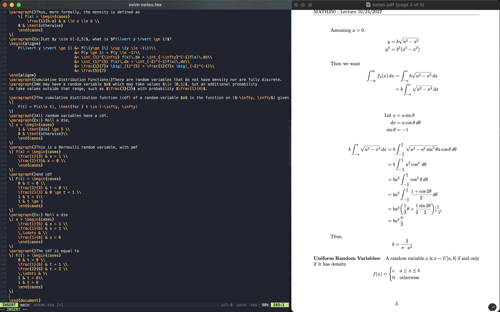

### My current nvim init.vim

### Includes
- LuaLine, nvimcmp, Mason.nvim

- Modular code compiling / running function

- Telescope fuzzy finder

- VimTeX

- Snippets (UltiSnips)

### Installation

Install [vim-plug](https://github.com/junegunn/vim-plug), run `:PlugInstall` in nvim. With pip, run
`pip install nvim`. Using Mason, install clangd, python, (or remove references to these LSPs)

For LaTeX support, use your OS's package manager to install `latexmk`, and `texshop`.

Depending on your OS, you will need to change the `makeprg` macro to invoke the correct
`gcc` executable. On Linux, it is `gcc`.
